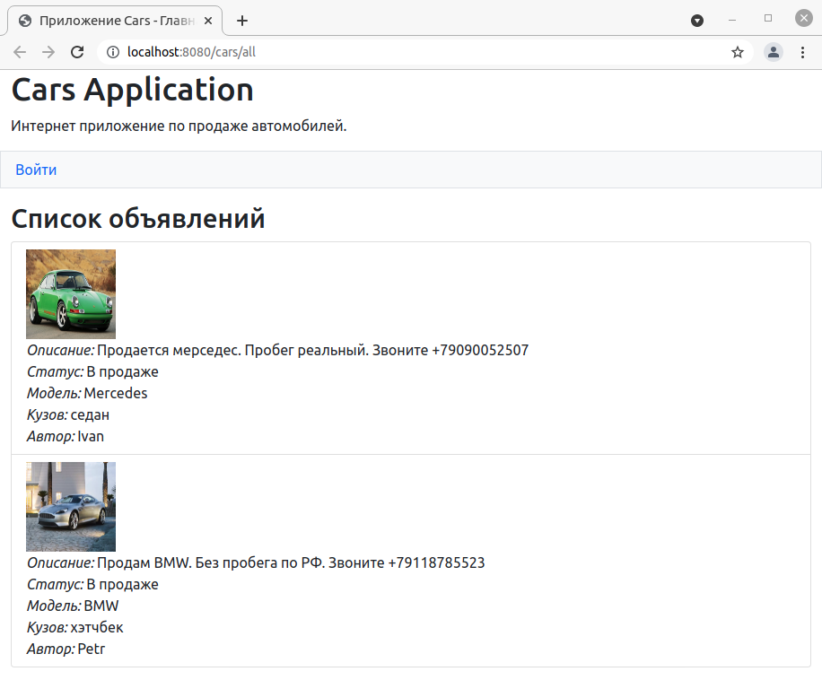
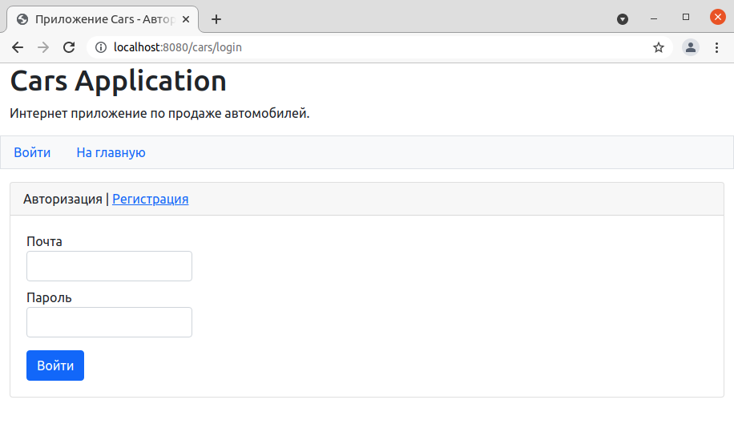
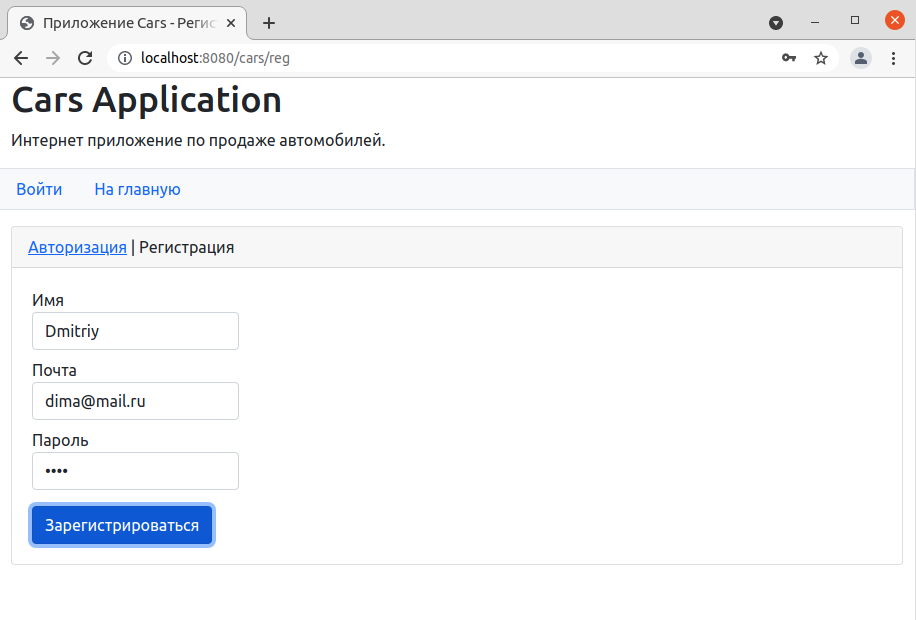
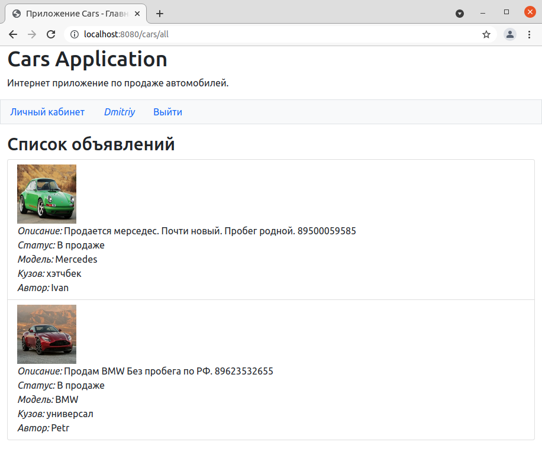
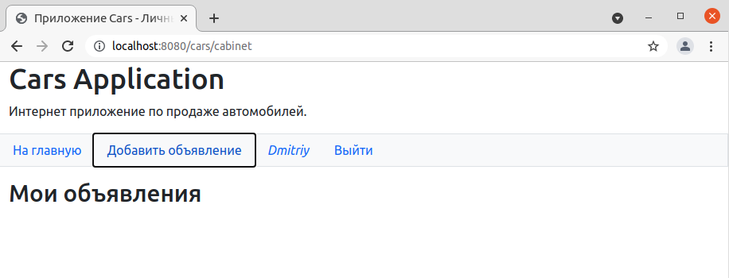
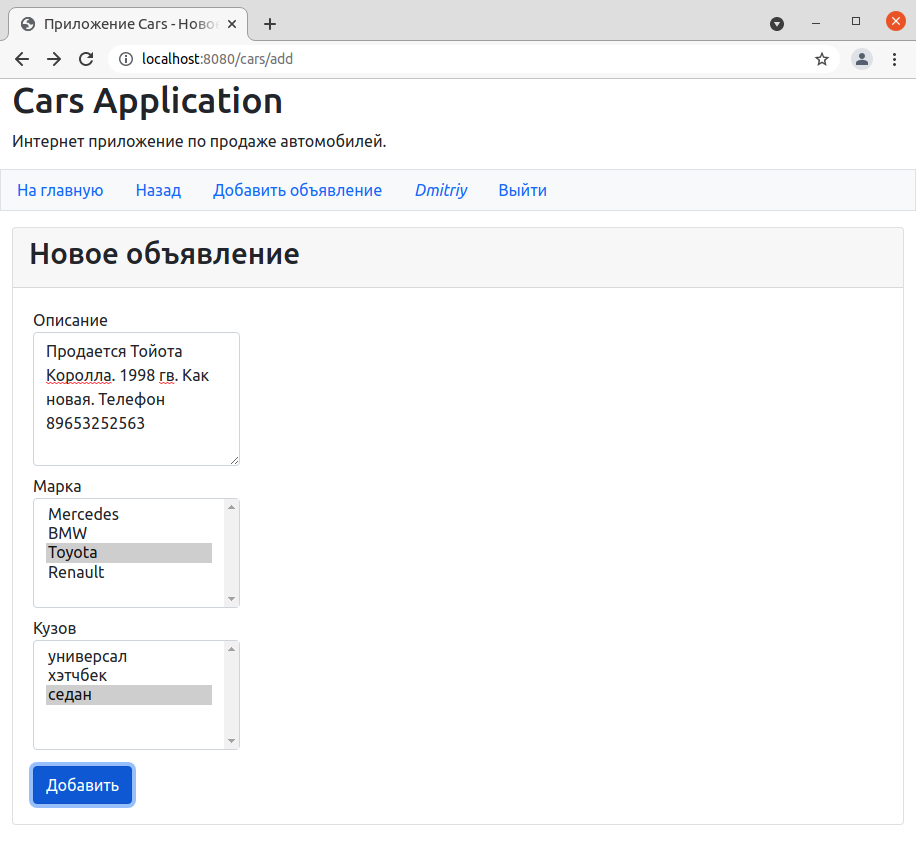
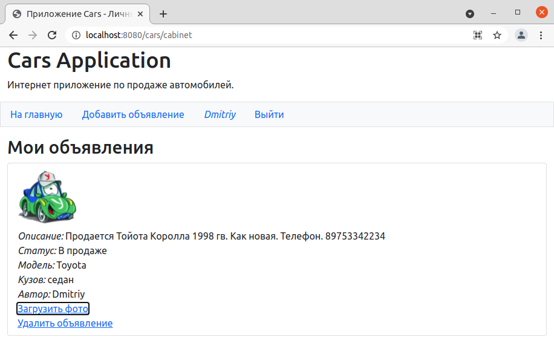
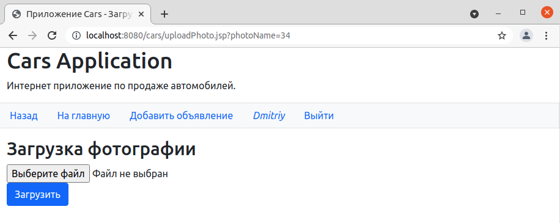
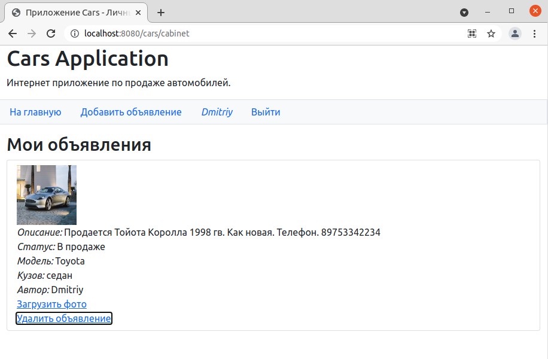
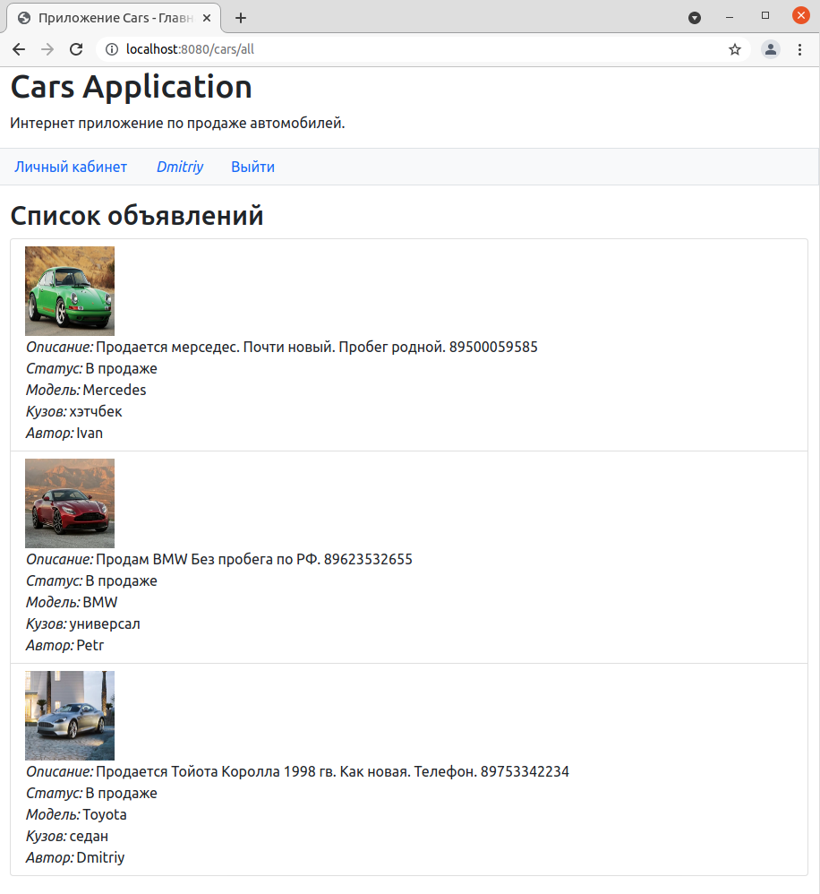

# Приложение Cars

## О проекте.
Веб приложение для размещения объявлений о продаже автомобилей.
Позволяет просматривать и добавлять объявления. 

## Сборка.
JDK14, Maven, PostgresSQL, Tomcat

## Как пользоваться.
На главной странице приложения доступен список всех объявлений.

Чтобы иметь возможность размещать объявления, необходимо авторизоваться
в системе, либо зарегистрироваться.
 

После авторизации происходит перенаправление на главную страницу, из которой
становится доступна ссылка на личный кабинет.

Для добавления объявления нужно перейти по ссылке "Добавить объявление" и
заполнить все необходимые поля.

Фото загружается отдельно после создания объявления.

После добавления объявления оно становится доступным для редактирования и удаления в личном кабинете 
и на главной странице. 

## Контакты.
Кутявин Владимир

skype: tribuna87

email: tribuna87@mail.ru