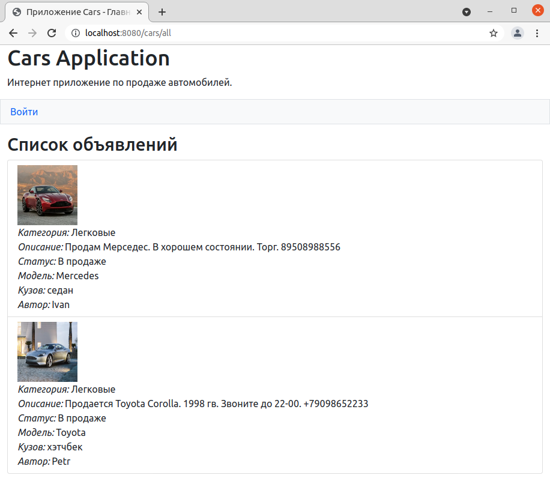
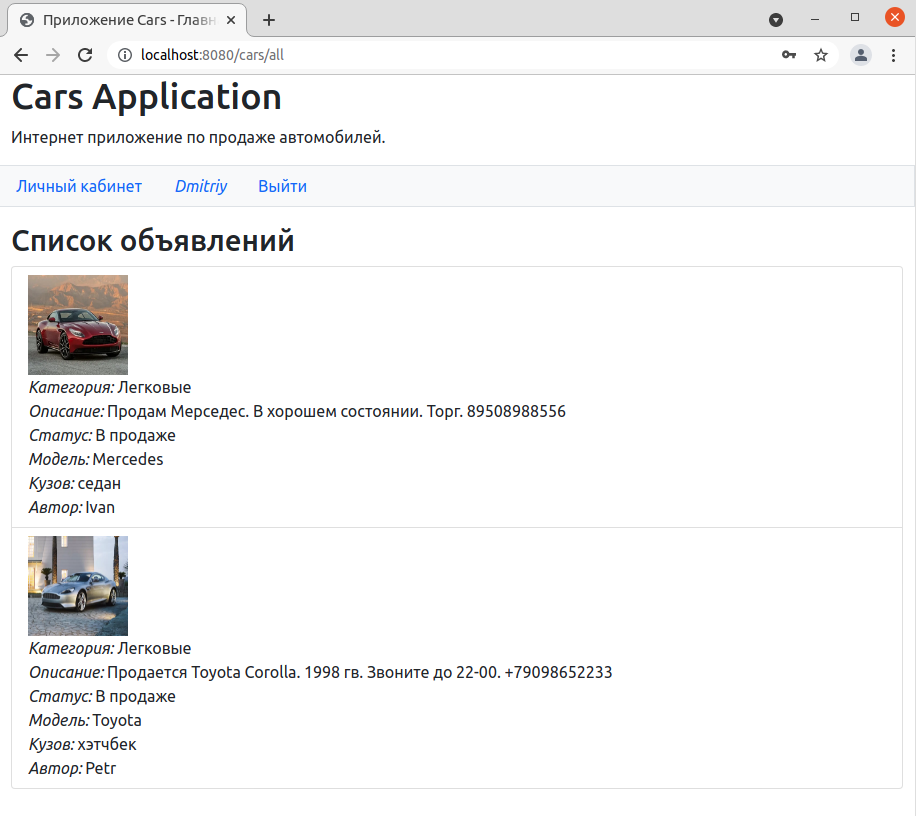
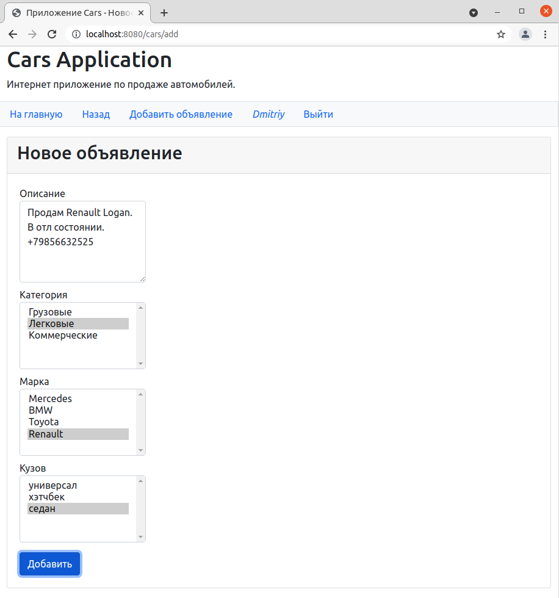
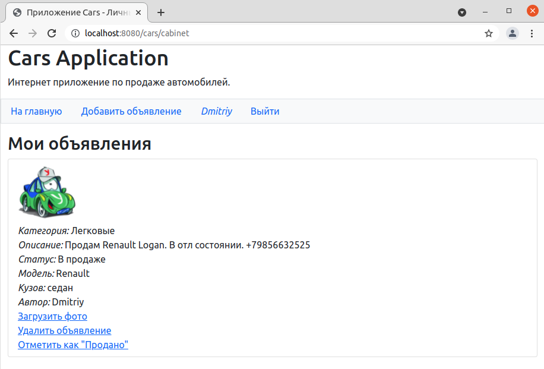
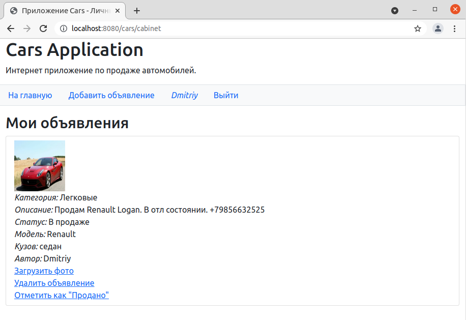
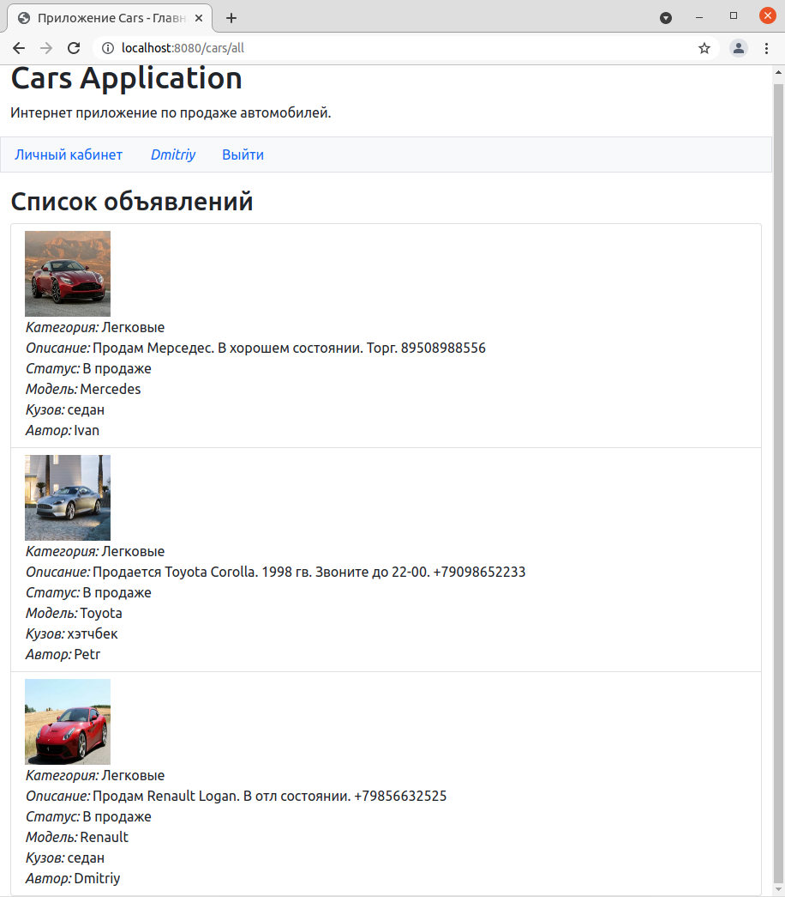

# Приложение Cars

## О проекте.
#### Описание
Веб приложение для размещения объявлений о продаже автомобилей.
Позволяет просматривать и добавлять объявления.

#### Технологии
>JDK14, Maven, PostgreSQL, Java Servlet, JSP, JSTL, Hibernate, Junit

## Сборка.
0. Скачать файлы репозитория
1. Создать базу данных в соответствии с настройками в файле *src/main/resources/hibernate.cfg.xml*
1. Произвести сборку проекта: `mvn clean install`
2. Скопировать полученный файл "job4j_cars-1.0.war" из папки target в папку вашего сервера
3. Приложение будет доступно по адресу: http://localhost:8080

## Как пользоваться.
На главной странице приложения доступен список всех объявлений.

Чтобы иметь возможность размещать объявления, необходимо авторизоваться
в системе, либо зарегистрироваться.
 

После авторизации происходит перенаправление на главную страницу, из которой
становится доступна ссылка на личный кабинет.

Для добавления объявления нужно перейти по ссылке "Добавить объявление" и
заполнить все необходимые поля.

Фото загружается отдельно после создания объявления.

После добавления объявления оно становится доступным для редактирования и удаления в личном кабинете 
и на главной странице. 

## Контакты.
Кутявин Владимир

skype: tribuna87

email: tribuna87@mail.ru